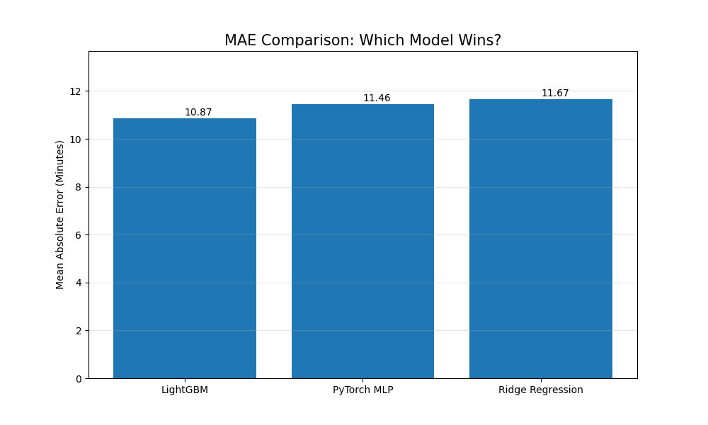
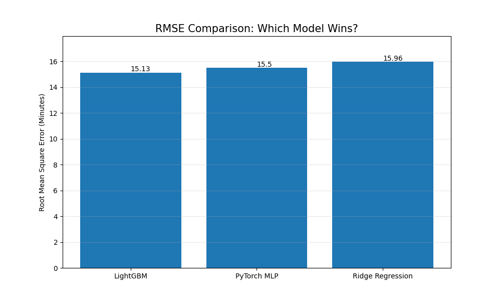
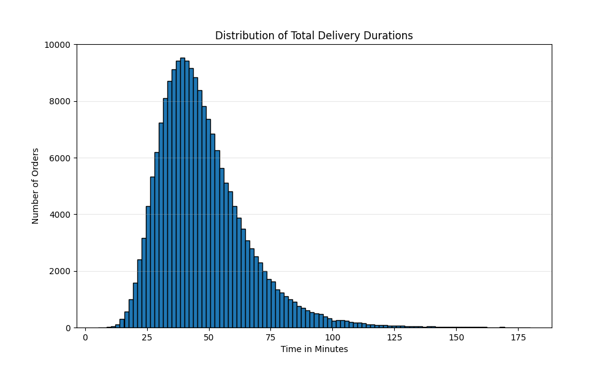
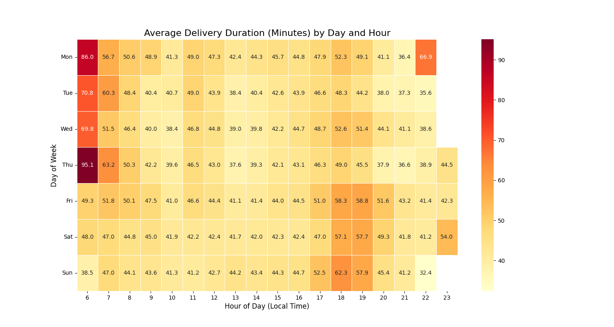
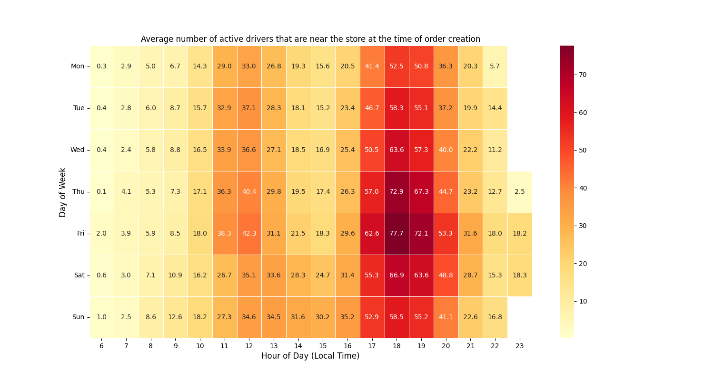
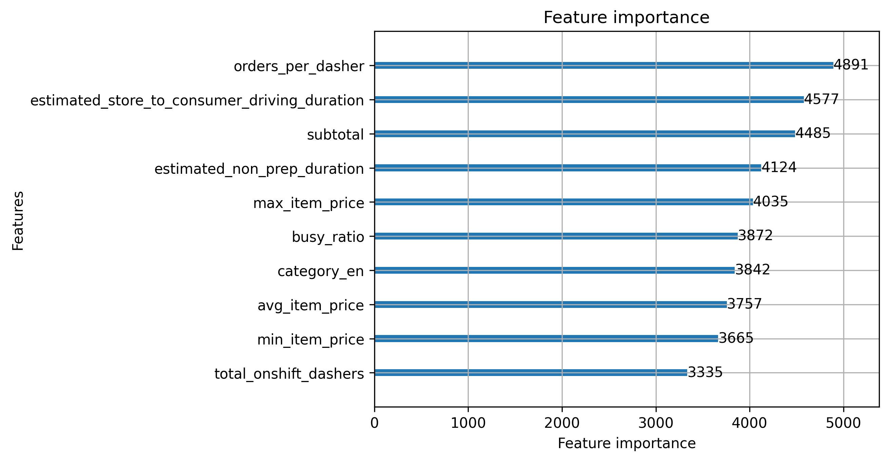

# DoorDash Delivery Duration Prediction

Predicting food delivery times using feature engineering and machine learning on historical DoorDash order data.

This is a practice project based on a [StrataScratch](https://platform.stratascratch.com/data-projects/delivery-duration-prediction) data science problem using a historical DoorDash dataset. 

This is my own independent implementation with different modeling and feature engineering choices.
Outperforms the official StrataScratch reference solution (RMSE ~16.4 min) by approximately 1.3 minutes through more extensive feature engineering.

---

## Problem

> **See `PROBLEM.md` for the full assignment description.**

Given a DoorDash order at submission time, predict the total delivery duration in seconds, from when the consumer places the order to when it arrives at their door.

---

## My Solution

[`notebook/solution.ipynb`](notebook/solution.ipynb)

---

## Results

| Model | MAE | RMSE |
|-------|-----|------|
| LightGBM | ~10.87 min | ~15.12 min |
| MLP (PyTorch) | ~11.44 min | ~15.58 min |
| Ridge Regression | ~11.67 min | ~15.96 min |

**MAE (Mean Absolute Error) :**  
Tells us, on average, how many minutes our predictions are off from the true values.

**RMSE (Root Mean Squared Error) :**  
Like MAE, it measures prediction error, but it penalizes large errors more than small ones.

---

## Files

```
├── datasets/historical_data.csv       # Raw dataset
├── PROBLEM.md                         # Full assignment description
└── notebook/solution.ipynb            # Notebook with full code
```

---

## Stack

- Python, Pandas, NumPy
- LightGBM
- PyTorch
- Scikit-learn (Ridge Regression, preprocessing)

---

## Key Decisions 

- **Chronological split over random split** : because random splitting would leak future information and training on past data while testing on future would produce more realistic result
- **Market-level median imputation** : dasher availability is a regional feature, so global median would be misleading
- **Target encoding over one-hot for cuisine category** : encodes the actual relationship between category and delivery time rather than treating categories as raw lables

---

## Approach

### 1. Data Cleaning
- Converted `created_at` and `actual_delivery_time` from strings to datetime
- Filtered out unrealistic deliveries (under 5 minutes or over 3 hours) to remove system errors and noise
- Filled missing `store_primary_category` using each store's most frequent category (mode per `store_id`)
- Filled missing dasher counts (`total_onshift_dashers`, `total_busy_dashers`, `total_outstanding_orders`) using per-market median, falling back to global median

### 2. Feature Engineering
- **Time features:** extracted `hour_of_day` and `day_of_week` from `created_at` (converted to US/Pacific time)
- **Marketplace load:** `busy_ratio = total_busy_dashers / total_onshift_dashers`
- **Dasher pressure:** `orders_per_dasher = total_outstanding_orders / total_onshift_dashers`
- **Order features:** `price_range`, `avg_item_price`
- **Estimated baseline:** `estimated_non_prep_duration = estimated_order_place_duration + estimated_store_to_consumer_driving_duration`
- **Category encoding:** target-encoded `store_primary_category` using mean delivery duration per category (computed on train set only)
- **Categorical encoding:** one-hot encoded `market_id` and `order_protocol`
- **Scaling:** features were standardized using `StandardScaler` before being passed to MLP and Ridge, as both models are sensitive to feature magnitude

### 3. Train/Test Split
- Sorted data by time and used an 80/20 chronological split (no random shuffle) to avoid leaking future data into training

### 4. Models

**LightGBM Regressor** (`n_estimators=1000`, `learning_rate=0.05`, `max_depth=6`)  
Chosen for strong performance on tabular data and its ability to handle missing values naturally.

**Ridge Regression**  
Used as a regularized linear baseline to compare how much of the prediction can be captured with simple linear relationships.

**MLP (PyTorch)**  
A multi-layer perceptron trained with the Adam optimizer. Used to capture non-linear patterns that a linear model may miss.

## Analysis & Visualizations

**1. Model Comparison with MAE and RMSE :**

This chart compares all three models using MAE (lower is better). 
It shows how prediction accuracy changes from the linear baseline (Ridge) to the neural network (MLP) to the gradient boosting model (LightGBM), and how much each model improves over the previous one.



This one compares RMSE. 



**2. Delivery Duration Distribution :**
This histogram shows the distribution of delivery times, where the horizontal axis represents the duration in minutes and the vertical axis represents the total count of orders. The height of the bars indicate how many deliveries fall into each time ranges, allowing you to see the most common delivery duration and the spread of the data.

We have most of our deliveries within 35-45 mins range, and there are some very long ones as well, at around 180 mins, which could happen (albeit extremely rarely) in real life.



**3. Average Delivery Time by Hour and Day :**
This heatmap displays average delivery durations in minutes, where each cell represents a time interval. 
The numeric values inside each cell show the mean delivery time for that specific time slot, with the colors indicating increasing duration. The values were calculated after eliminating extreme outliers (possible errors) in the data.

We can observe that deliveries take longer around peak dinner and lunch hours, but the longest deliveries happen at early mornings where there are very few fully operating stores as well as drivers. Could also be because the sample size is small. 



**4. Average Number of Active Drivers that are near the store at the time of Order Creation :**
This one shows the average number of available drivers near stores. The values are representing the mean number of on-shift drivers within 10 miles of a store at the time of the order creation.

Even though the number of orders peak during lunch and dinner times, the number of active and nearby drivers peak as well and are sufficient to meet the demand, which is why we don't see a significant increase in delivery durations during those times.



**5. LightGBM Feature Importance (what variables influenced the prediction the most) :**

This bar chart ranks the top 10 model features along the vertical axis based on their importance scores, which are plotted along the horizontal axis. 
Each horizontal bar represents a specific variable, with the length of the bar and the labeled values indicating how much weight that feature carries in the model's predictions.

